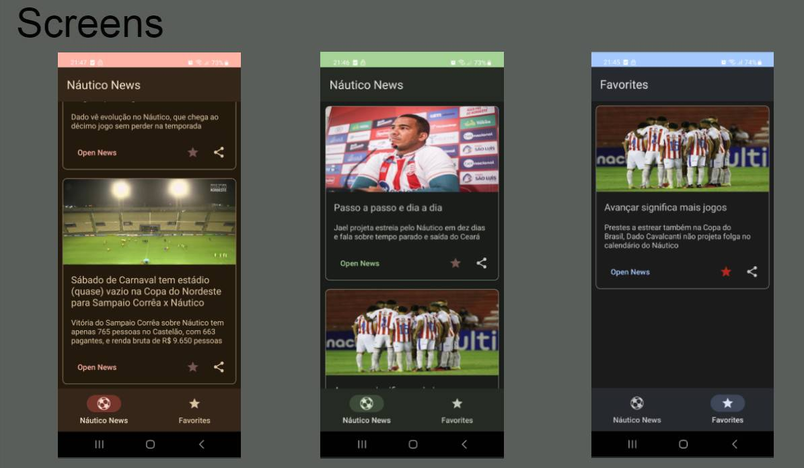

# Soccer News APP

Native Android app in Java programming language, using native components like Android Jetpack, Retrofit, and Room. For this, I used a REST API for women's soccer news. Was created during this project challenge at Santander Bootcamp Mobile Developer. I made some changes, for example, applying Dynamic color Material Design 3 makes the app's UI match the device's theme color palette.

